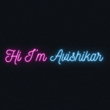

  

<h1 align="center">Hi 👋, I'm Avishikar Kannan</h1>

  A curious soul driven by learning. I love exploring new tech, building cool projects, and solving problems through code. 
  Currently diving deeper into Artificial Intelligence and Machine Learning 🤖

---

## 🛠️ Tech Stack

  
  
  
  
  
  
  
  
  

---

<h2 align="center">⚡ Stats ⚡</h2>

 

---

## 🧠 Currently Learning
AI Projects • Arduino Hacks • Creative Interfaces • Model Deployment
